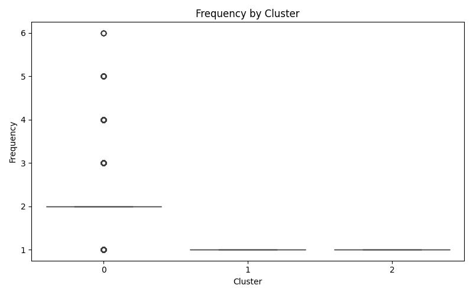
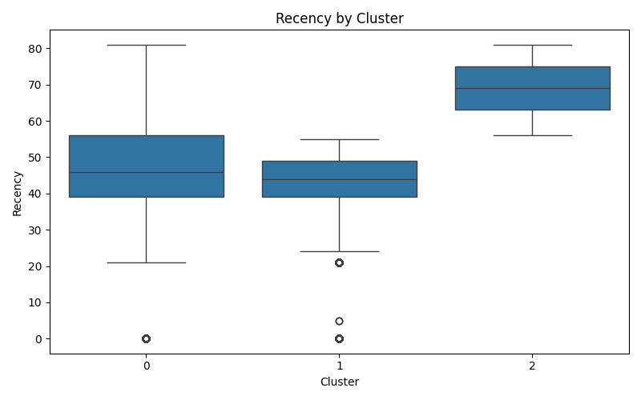
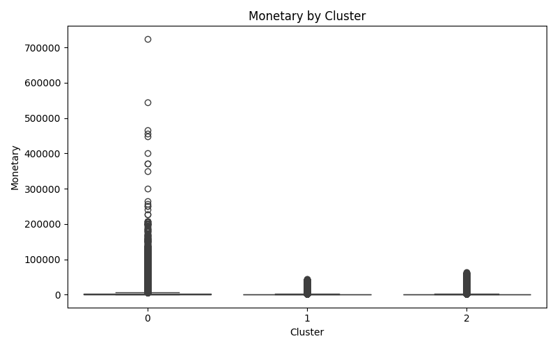

# 🧠 Customer Segmentation with RFM Analysis and Flask Web App

This project performs customer segmentation using RFM (Recency, Frequency, Monetary) analysis and K-Means clustering. It includes both model development in a Jupyter notebook and a production-ready Flask web application to upload CSVs, predict clusters, and visualize customer behavior.

---

## 📌 Project Structure

- **Customer_Segmentation/**
  - `app.py` - Flask application
  - `cust_segmentation.ipynb` - Notebook for model training & saving
  - `KMeans_model.pkl` - Pickle file with trained KMeans model + scaler
  - `README.md` - Project documentation
  - **uploads/** - Uploaded CSV files (auto-created)
    - `(your_uploaded_file.csv)`
  - **results/** - Output CSVs with predictions
    - `prediction_results_*.csv`
  - **static/** - Auto-generated plots
    - `Frequency.png`
    - `Recency.png`
    - `Monetary.png`
  - **templates/** - HTML templates for Flask
    - `index.html`


---

## 🔍 Overview

This project clusters bank customers into meaningful groups using unsupervised learning based on their transaction behavior. It combines:

- 📊 **RFM feature engineering**: Recency, Frequency, and Monetary value
- 🤖 **KMeans clustering**: Groups customers into segments
- 🌐 **Flask web app**: Upload CSVs → Predict clusters → Visualize plots → Download results

---

## 🛠️ Tech Stack

- Python 3.9
- Pandas, NumPy
- Scikit-learn
- Seaborn & Matplotlib
- Flask

---

## 📈 Model Building (`cust_segmentation.ipynb`)

- Reads transaction data
- Calculates RFM features per customer
- Scales features using `StandardScaler`
- Applies `KMeans` clustering
- Saves both the model and scaler together using `pickle`

> Output: `KMeans_model.pkl` (model + scaler)

---

## 🚀 Web App (`app.py`)

### Features:
- Upload `.csv` cleaned file of transaction data
- Automatically computes RFM features
- Loads pre-trained KMeans model + scaler
- Predicts customer clusters
- Saves result CSV and generates:
  - 📦 `Frequency by Cluster`
  - 📦 `Recency by Cluster`
  - 📦 `Monetary by Cluster` box plots

--- ## 📸 Screenshots of Flask App

### 🔹 Homepage (Upload Form)


### 🔹 File Selected State


### 🔹 Output with Cluster Plots


---

## 📷 Sample Output

<p align="center">
  
  
  
</p>

---

## ▶️ How to Run

### 🔧 1. Clone the Repo
```bash
git clone https://github.com/DeepthiPavurala/Customer_Segmentation.git
cd Customer_Segmentation
